# Components

While [Earthbar](earthbar) is a good one-stop-shop for Earthstar functionality, there are many occasions when it will make more sense to embed those features within your own interfaces.

And you _could_ write those yourself, but why not use these pre-made, accessibility-ready components instead?

The screenshots below are of the components with the default layout styles and 'Junior' theme applied. To learn more about styling, see the [Styling Guide](styling.md)

## AddWorkspaceForm

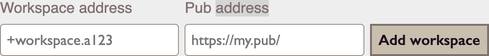

A form where you can input a workspace address and initial pub manually. Not the best for adding an existing workspace (see InvitationRedemptionForm), and not the best for creating a new one (see WorkspaceCreatorForm), but an acceptable middle-ground.

## AuthorKeypairForm

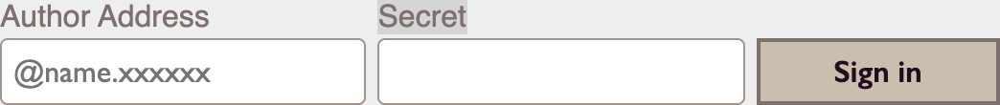

A form where you can type in an author address and secret and use it to set the current author (if it's a valid pair).

## AuthorKeypairUpload

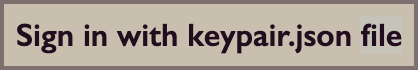

A button you can press to summon a file chooser to upload a keypair.json. Sets the current author if valid.

## AuthorLabel

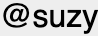

Given an author address (e.g. `@suzy.1abe7...`) returns a span containing the shortname (e.g. `@suzy`).

## CopyAuthorAddressButton

A button which copies the current author's address to the clipboard.

## CopyAuthorSecretButton

A button which copies the current author's secret to the clipboard.

## CurrentAuthor

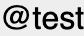

A label showing the current author's shortname (e.g. `@suzy`), or "Not signed in" in the case of no current author.

## CurrentWorkspaceSelect

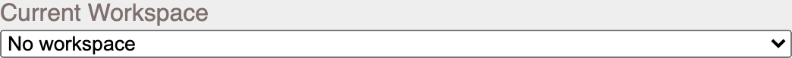

A `<select>` element which changes the current workspace.

## DisplayNameForm

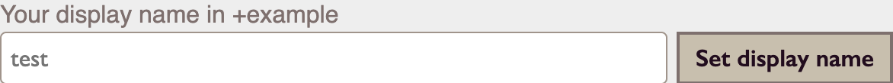

A form which changes the display name of the current author for a workspace specified by the `workspaceAddress` prop.

## DownloadKeypairButton

A button which triggers a download of the current author's keypair.json when clicked.

## InvitationCreatorForm

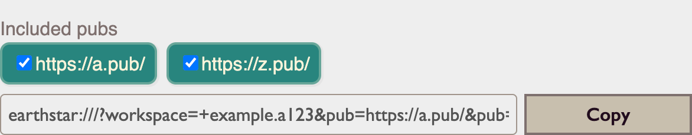

A form which creates an invitation code for a given workspace, provided via the `workspaceAddress` prop. The form offers an interface for selecting which pubs are embedded along with the invitation code.

## InvitationRedemptionForm

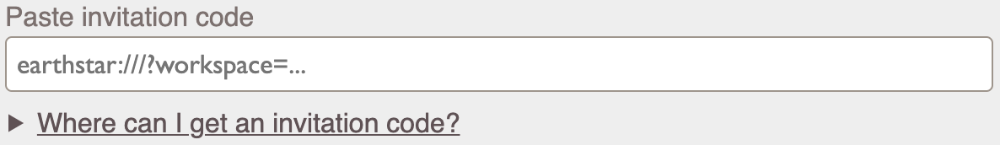

A form which takes an invitation code and adds the encoded workspace and pubs to the app. Also offers an interface for selecting which pubs you'd like to add.

## NewKeypairForm

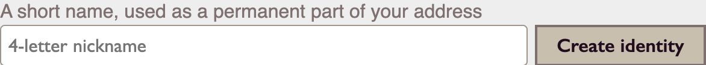

A form for generating a new author keypair from a four-letter input. Has an `onSuccess` prop which is a callback with a `AuthorKeypair` as its first argument.

## PubEditor

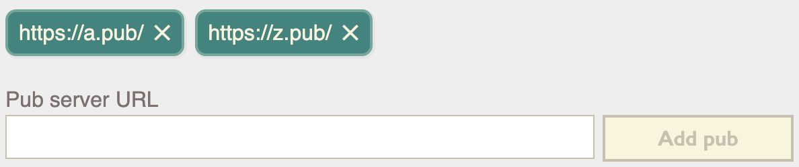

An interface for adding and removing pub servers for the workspace given by the `workspaceAddress` prop.

## RemoveWorkspaceButton

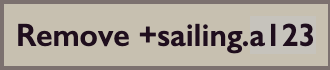

A button which removes the workspace given by the `workspaceAddress` prop when clicked.

## SignOutButton

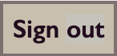

A button which unsets the current author when clicked.

## SyncingCheckbox

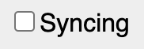

A checkbox which toggles whether workspaces are being synced with pub servers or not.

## WorkspaceCreatorForm

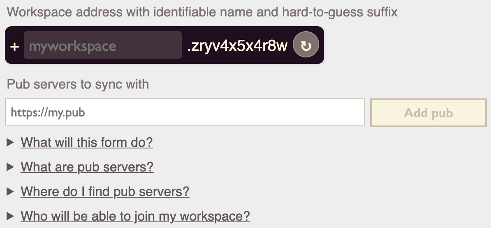

A form which helps create valid and suitably random workspace addresses. Also offers a combobox which can be used to associate known pubs from other workspaces with the new one.

## WorkspaceLabel

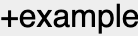

A label which takes a workspace address (e.g. `+trains.a123`) and returns an anonymised version (e.g. `+trains`)

## WorkspaceList

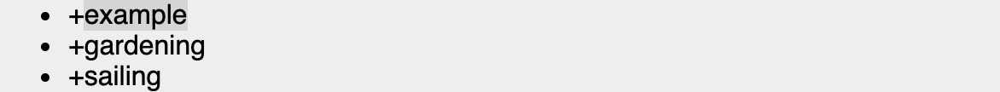

A bullet point list of all known workspaces.
