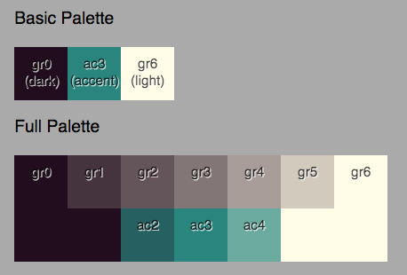

# Styling guide

react-earthstar offers a number of React components for you to use, the most useful being the [Earthbar](earthbar.md). To make it work well, it will need styling applied to it with CSS.

How much styling you do is up to you. react-earthstar has been made so that you can tweak a few colour variables, or style everything by yourself.

## Layout styles

This library comes with a stylesheet you'll almost definitely want to use, which applies sensible layouts to all the components exported by this library. It can be found in `styles/layout.css` in the package.

If you're using a bundler that support CSS imports, you can use it like this:

```js
import "react-earthstar/styles/layout.css"
```

This is a great starting point if you want to get right in and do the fun styling stuff — typography! Colours! Animations! — yourself.

## Pre-made themes

Maybe you want something that looks fancy straight away. Then, in addition to using `layout.css`, you should import react-earthstar's default theme:

```js
import "react-earthstar/styles/layout.css";
import "react-earthstar/styles/junior.css";
```

That Earthbar with the `junior` skin looks like this:

(image)

## Changing the colour scheme and font of pre-made skins

Maybe you don't like creamy yellow and green. Fine! It's easy to change the colour scheme of the Junior skin, which is defined using CSS variables:



```css
:root {
  // The lightest colour
  --gr6: #faf4da;
  --gr5: #c8bfae;
  --gr4: #a0948b;
  --gr3: #7e706e;
  --gr2: #615155;
  --gr1: #44313b;
  // The darkest colour
  --gr0: #220d1e;
  --ac4: #68a699;
  // The accent colour
  --ac3: #29857e;
  --ac2: #276060;
  // Typeface used by Earthbar
  --t1: 'Gill Sans', sans-serif;
}
```

Here are all the variables defined in `junior.css`. Redeclare them in a stylesheet _after_ junior.css in the document, and you'll be able to change them to whatever you prefer.

To easily make a palette with the same contrast relationships as the default, you can use [Cinnamon's palette generator](https://codesandbox.io/s/color-contrast-calculator-2-k0som), or create one using [make-color-theme](https://github.com/earthstar-project/make-color-theme).

## Making your own skin

All the components use data-attributes prefixed with `data-re-` (re signifying react-earthstar), so you can target elements with syntax like this:

```
[data-re-earthbar] {
  color: pink;  
}
```

There are a _lot_ of these attributes, too many to list here. But very few of them are dynamically controlled, so you can get a good overview through a DOM inspector. Failing that, you can look at [component source](../src/components).

If you make a great theme, please consider contributing it back to this package!

